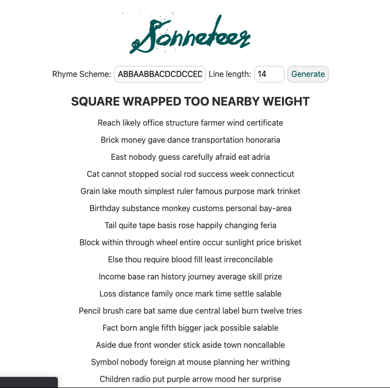

# Sonneteer

Sonneteer generates poems! Users configure rhyme scheme and syllable count per line, press 'Generate', and Boom!
Why be like Keats etc and spend days on a single poem when you can make one just as good with the press of a button?

Sonneteer is built with Svelte and TypeScript. It is deployed [HERE](https://n-ckr-ch-rds-n.github.io/sonneteer2/).

Or, if you really want to, you can clone this repo, `npm install` and `npm run dev`.
